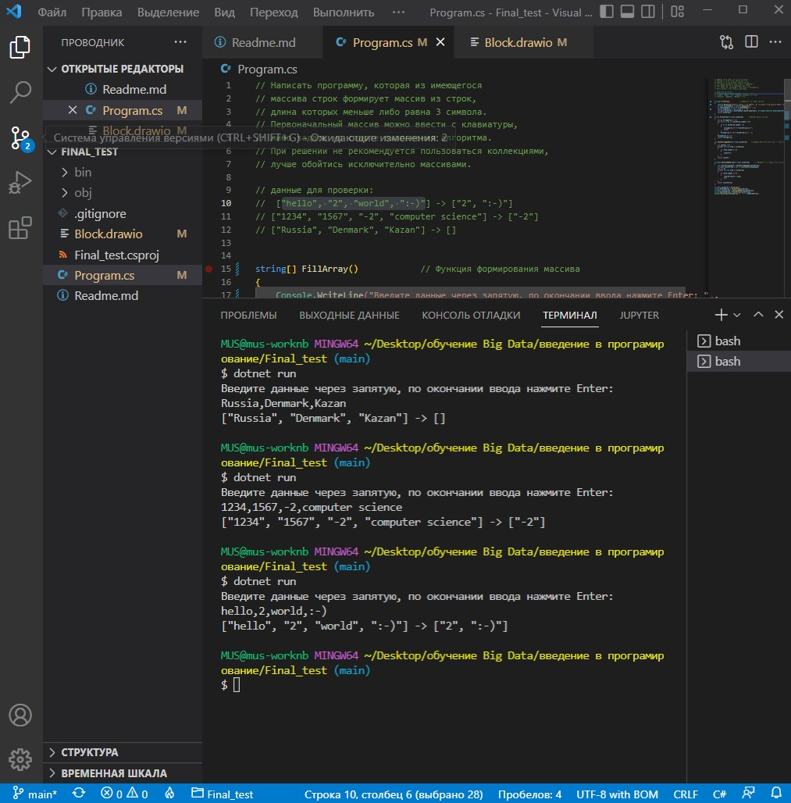

## Итоговая проверочная работа.

**Задача**: Написать программу, которая из имеющегося массива строк формирует массив из строк, длина которых меньше либо равна 3 символа. Первоначальный массив можно ввести с клавиатуры, либо задать на старте выполнения алгоритма. При решении не рекомендуется пользоваться коллекциями, лучше обойтись исключительно массивами.

**Примеры**:

["hello", "2", "world", ":-)"] -> ["2", ":-)"]

["1234", "1567", "-2", "computer science"] -> ["-2"]

["Russia", "Denmark", "Kazan"] -> []

## Этапы решения
- создан проект на [GitHub](https://github.com/AlexandNovikov/prog_step1_final_work)
- создан файл для фильтрации загружаемых данных в GitHub **.gitignore**  
- создана блок-схема решения
- написан код с использованием массивов и локальных функций
- каждый этап был закомментирован и загружен в репозиторий

_для решения задачи были написаны локальне функции_

**- функция заполнения массива, используется ввод с клавиатуры**

**- функция печати массива**

**- функция подсчета количества символов в введнных значениях**

**- функция для заполнения и печати нового массива после подсчета и отсева лишних данных _(отсев производился по количеству меньше либо равна 3)_**

## Окно выполнения решения

